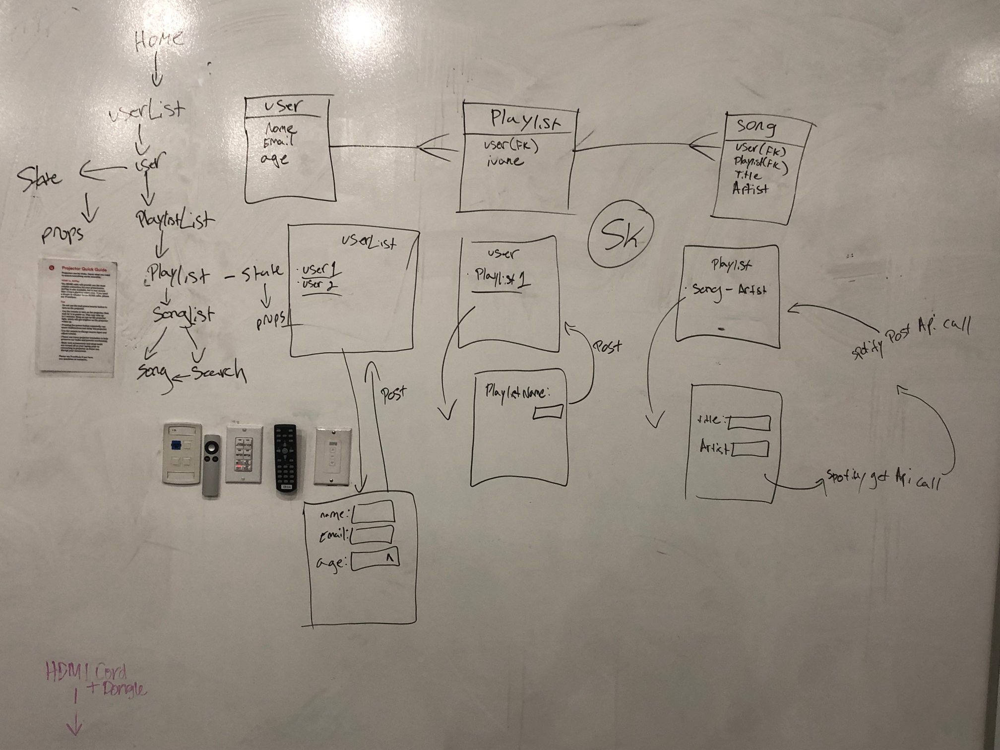
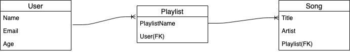

# Django Playlist- Project 4 for General Assembly(Atlanta)

We all listen to music on an almost daily basis. As music listeners we often create a playlist on various services, so I wanted to try my hand at creating the functionality for creating a playlist. The project will allow users to create, view and edit the playlist. Using the technology listed below, I have created an app that allows users to do just that. At the start of the module to prepare user will begin creating a profile by following step by step procedures to create their own personal playlist and allow others to view.

App: [App](https://playlist-project.herokuapp.com/)

[Trello](https://trello.com/b/PJj8wLcX/playlist-app)

Whiteboarding

ERD

### Technology Used

* AJAX

* CSS

* Django

* Heroku

* JavaScript

* React

* Deezer Api